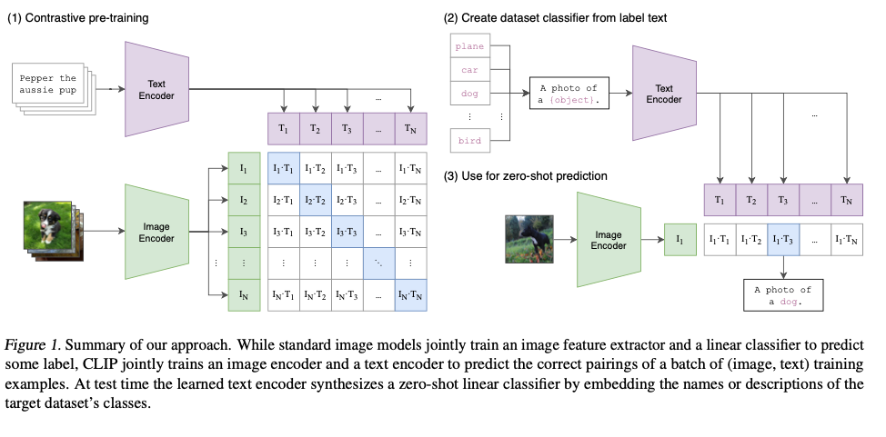
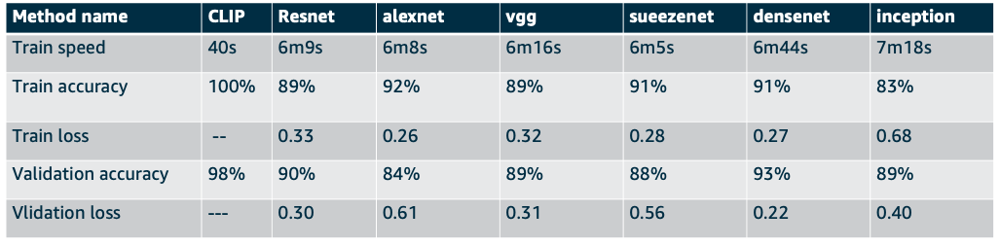

# zero-shot-clip
Experiment on clip vs classic pretrained image classsification models

## what is clip



CLIP主要完成的任务是：给定一幅图像，在32768个随机抽取的文本片段中，找到能匹配的那个文本。为了完成这个任务，CLIP这个模型需要学习识别图像中各种视觉概念，并将视觉概念将图片关联，也因此，CLIP可以用于几乎任意视觉人类任务。例如，一个数据集的任务为区分猫和狗，则CLIP模型预测图像更匹配文字描述“一张狗的照片”还是“一张猫的照片”。

* [Paper](https://cdn.openai.com/papers/Learning_Transferable_Visual_Models_From_Natural_Language_Supervision.pdf)
* [Code](https://github.com/openai/CLIP)


## data
below task is based on dataset from [opensource](https://datalab2021.s3.us-east-2.amazonaws.com/gree/data.zip)  (this is an internal link, contact author for the dataset!) 
unzip and put it under `source` folder to proceed

## run clip on Amazon SageMaker quick start

clip have two ways to use direcly, one is use it as zero-shot learning, one is for logistic regression finetuned.

it's simple to use, integrate with `dataloader` class.

refer to `source/clip.ipynb` for details

## comparison task, compare clip vs. traditional method (build on torchvision)

```shell script
source activate pytorch_p36
# the script will run training over "resnet", "alexnet", "vgg", "squeezenet", "densenet", "inception" for 50 epcoh each, and print out accuracy on same dataset
python source/train.py
```

result looks like below:



